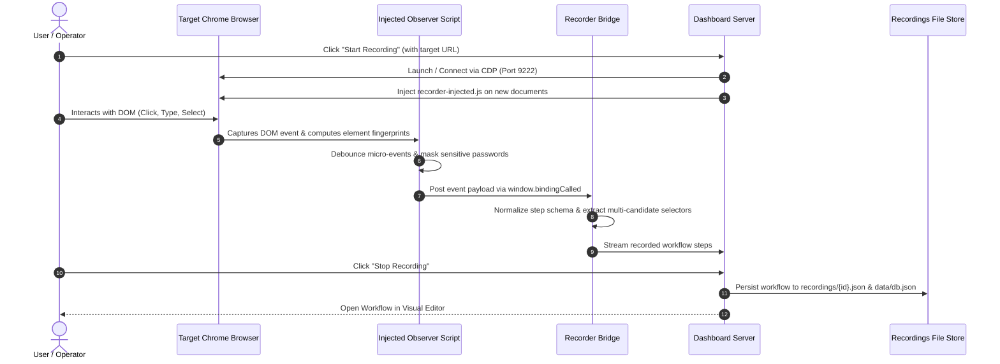
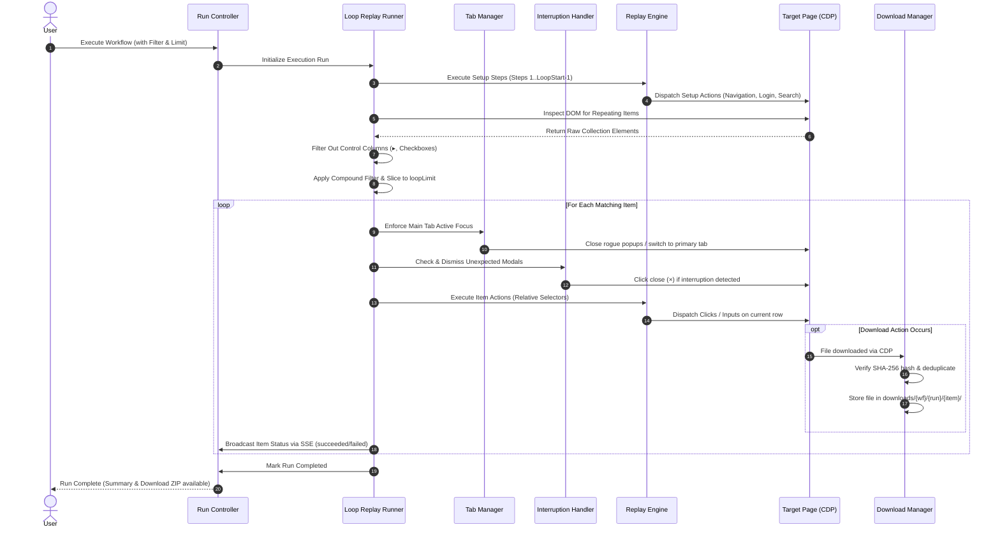

# Workflow Capture — Complete Product Documentation & Architecture Manual

## 1. Executive Summary & Product Overview

**Workflow Capture** is a production-grade, generic browser automation and robotic process automation (RPA) engine. Built on top of the Chrome DevTools Protocol (CDP), it empowers users to record web-based procedures once—such as downloading invoices, exporting reports, or navigating multi-page tabular data—and autonomously generalize those actions across hundreds of records without recording each item individually.

### Core Value Proposition
- **Record Procedures, Not Records**: Demonstrate an action on a single item; the engine discovers repeating siblings across the entire table or grid.
- **Resilient & Portal-Agnostic**: Multi-strategy selector fingerprinting overcomes transient classes, dynamic IDs, and DOM changes across ERPs, accounting portals, and modern web apps.
- **Enterprise-Grade Traceability**: End-to-end data tracking preserves the strict hierarchy: **Workflow → Run/Timestamp → Item → Download Artifact**.

---

## 2. Technology Stack

Workflow Capture is intentionally engineered with minimal external dependencies to ensure ultra-low overhead, maximum execution speed, and high security.

| Tier | Technology / Library | Purpose & Implementation Details |
| :--- | :--- | :--- |
| **Runtime & Server** | **Node.js (v18+, v20+ recommended)** | CommonJS execution runtime with zero external web framework overhead (native `http` server in `src/dashboard/server.js`). |
| **Browser Protocol** | **Puppeteer-Core (`^22.15.0`) + CDP** | Direct WebSocket connection to Chrome via Chrome DevTools Protocol (`src/utils/cdp-connector.js`). Bypasses heavy browser wrappers. |
| **Database & Persistence** | **Custom Transactional `JsonDB`** | Lightweight, zero-dependency, atomic file-based persistence engine (`src/database/db.js`) maintaining state in `data/db.json`. |
| **Frontend Framework** | **Vanilla ES6+ JavaScript** | Native ES modules (`src/dashboard/public/js/`), Semantic HTML5, and responsive Vanilla CSS. Zero React/Vue bloat. |
| **Visual Workflow Canvas** | **Drawflow (`src/dashboard/public/vendor/drawflow/`)** | Interactive node-based drag-and-drop workflow canvas for editing steps, loops, and conditions. |
| **Real-Time Telemetry** | **Server-Sent Events (SSE)** | Unidirectional streaming (`/api/runs/:id/events`) for live log tails, per-item status updates, and execution metrics. |
| **Security & Cryptography** | **Node.js `crypto` Module** | AES-256-GCM encryption for credentials (`src/auth/secret-util.js`), PBKDF2/SHA-256 password hashing, and SHA-256 file deduplication. |
| **Anti-Bot & Emulation** | **Custom Bezier Curve Engine** | Humanized cursor trajectories, random jitter, and variable typing delays (`src/replay/human-mouse.js`, `src/api/bot-config-controller.js`). |
| **Testing Harness** | **Node.js Native Test Runner (`node --test`)** | Deterministic sequential test execution (`--test-concurrency=1`) across 25 isolated unit, API, and synthetic portal suites. |

---

## 3. GitHub Repository Details

- **Repository URL**: `https://github.com/AbuZar-Babar/Workflow-Capture.git`
- **Active Branch**: `ADDING-LANDING-PAGE` (tracking `origin/ADDING-LANDING-PAGE`)
- **Default Upstream Branch**: `main` / `master`
- **License**: MIT
- **Primary Language**: JavaScript (Node.js & Browser ES6)

### Repository Directory Layout
```text
Workflow-Capture/
├── ARCHITECTURE.md                 # Foundational Architectural Decision Records (ADRs)
├── README.md                       # Quickstart, installation, and run instructions
├── package.json                    # Scripts, dependencies, and test commands
├── data/
│   └── db.json                     # Persistent database file (Users, Workflows, Runs, Secrets, Downloads)
├── downloads/                      # Organized downloaded artifacts: /{workflow}/{runId}/{itemId}/
├── recordings/                     # Serialized raw recordings (.json)
├── src/
│   ├── api/                        # REST Controllers (run, workflow, bot-config, secret)
│   ├── auth/                       # Auth middleware, JWT token service, password hashing
│   ├── dashboard/                  # Native HTTP Server & Static UI Assets
│   │   ├── server.js               # Core HTTP server, routing, SSE broadcast, preflight inspector
│   │   └── public/                 # HTML/CSS/JS frontend, visual editor, execution modal, landing page
│   ├── database/                   # Transactional JsonDB storage engine (db.js)
│   ├── engine/                     # Workflow knowledge compiler, intent resolution, state machine
│   ├── profiles/                   # Portal-specific profile adapters (e.g., CityMart profile)
│   ├── recorder/                   # CDP recording bridge and in-page observer scripts
│   ├── replay/                     # Execution engine, loop runner, tab manager, interruption handler
│   ├── shared/                     # Pure heuristics: item discovery, filtering, selector resolution
│   └── utils/                      # CDP connector, logging, URL normalizers, custom errors
└── test/                           # 25 automated unit, integration, and cross-portal test suites
```

### Essential NPM Scripts
- `npm run dashboard`: Launches the Mission Control dashboard server at `http://127.0.0.1:3000`.
- `npm run record`: CLI interface for recording browser sessions via remote CDP.
- `npm run replay`: Headless/headed replay runner CLI.
- `npm test` or `npm run test:fast`: Runs all unit and API tests sequentially in seconds with 0 regressions.
- `npm run test:unit`: Executes isolated unit test suites (Item Discovery, Selector Resolver, Loop Engine, etc.).
- `npm run test:api`: Executes REST API and run lifecycle integration suites.

---

## 4. Features Deployed (Production Capabilities)

### 4.1. Browser Workflow Recorder
- **CDP-Driven Event Capture**: Attaches to Chrome via DevTools Protocol (`Input.dispatchMouseEvent`, `Page.addScriptToEvaluateOnNewDocument`).
- **Debounced Event Aggregation**: Filters out redundant micro-events, text selection noise, and transient hovering.
- **Multi-Strategy Selector Fingerprinting**: Extracts 5+ fallback selector candidates for every element:
  1. Semantic IDs & `data-testid` attributes (with transient UUID stripping).
  2. Accessibility roles (`role="button"`, ARIA labels).
  3. Strict visible text matching (e.g., `button:has-text("Download PDF")`).
  4. Hierarchical CSS selector paths.
  5. Deterministic XPath queries.
- **Sensitive Input Masking**: Automatically detects password fields and sensitive inputs, omitting raw values from recorded JSON files.

### 4.2. Visual Workflow Editor & Graph
- **Interactive Drawflow Canvas**: Node-based graphical representation of workflows.
- **Loop Boundary Markers**: User can select the repeating loop target step; the engine automatically partitions preceding steps as one-time setup steps.
- **Step Configuration Modal**: Visual editing of selector targets, delay parameters, input values, and optional flags.
- **Real-Time JSON Inspection**: Instant toggle between node graph and formatted JSON payload.

### 4.3. Autonomous Repeating Item & Table Discovery
- **Heuristic Pattern Scoring**: Inspects DOM trees to identify repeating data collections (HTML `<table>`, `<tbody>`, CSS grid, flex layouts, ARIA `grid`/`rowgroup`).
- **Utility & Expander Column Alignment**: Automatically filters out checkbox columns (`td[0]`), radio buttons, and accordion/expander toggle arrows (`▸`, `▼`, `+`). Aligns business column headers (e.g., `Invoice No`, `Issued`, `Due Date`, `Amount`) 1-to-1 with actual data cells without offset shifts.
- **Document ID Self-Healing**: Automatically scans cell content and raw text using regex patterns (`SI-`, `INV-`, `TX-`, `PO-`, etc.) to recover valid invoice IDs even if portal layouts lack distinct column headers.

### 4.4. Compound Filtering Engine
- **Match Modes**: Supports both `all` (AND) and `any` (OR) boolean evaluation logic.
- **Rich Condition Operators**:
  - `contains`: Case-insensitive substring matching after trimming whitespace.
  - `equals`: Strict case-insensitive equality.
  - `dateBetween`: Strict `YYYY-MM-DD` calendar date comparison (`from <= value <= to`). Invalid or unparseable dates result in explicit skip reasons (`SKIPPED_FILTER`).
- **Zero Silent Fallback**: If a configured filter references a field not present in the discovered item schema, execution immediately halts with a configuration error rather than falling back to full-row text matching.
- **Attempt Limit (`loopLimit`)**: Applies positive integer limits to the first N matching items. Retries do not consume additional attempt slots.

### 4.5. Universal Date Handler
- **Headless Value Injection**: Injects formatted dates directly into native HTML5 `<input type="date">` elements via DOM value setters, avoiding intrusive operating system datepicker popups.
- **Multi-Format Normalization**: Ingests multiple user date formats (`YYYY-MM-DD`, `DD/MM/YYYY`, `MM/DD/YYYY`, `DD-MMM-YYYY`) and normalizes them into the portal's target layout.
- **Custom Calendar Widget Bypassing**: Handles portals with custom JavaScript datepickers (e.g., flatpickr, Bootstrap datepicker) by targeting hidden backing inputs.

### 4.6. Universal Exception & Interruption Handling
- **Autonomous Modal & Popup Dismissal**: Detects unexpected popups, session prompts, marketing overlays, and cookie consent banners (`src/replay/interruption-handler.js`).
- **Generic Dismissal Logic**: Identifies close buttons (`×`, `close`, `dismiss`, `cancel`, `btn-close`) and dismisses them without corrupting the active workflow state.
- **State Preservation**: Resumes the exact pending step once the interruption is dismissed.

### 4.7. Intelligent Multi-Tab & Window Management
- **CDP Target Tracking**: Monitors newly created browser targets (`Target.targetCreated`, `Target.targetDestroyed`).
- **Rogue Tab Auto-Closure**: Identifies extraneous tabs opened by portals (e.g., advertising popunders, helper links) and safely terminates them.
- **Focus Preservation**: Automatically switches focus back to the primary workflow window (`src/replay/tab-manager.js`) to ensure continuous execution.

### 4.8. Idempotent Checkbox & Multi-Selection Handler
- **State-Aware Clicking**: Evaluates whether a checkbox or toggle button is already checked before dispatching a click action.
- **Multi-Checkbox Preservation**: Supports workflows where multiple distinct checkboxes must be activated in sequence without toggling them off.

### 4.9. Download Deduplication & Artifact Traceability
- **Direct CDP Download Redirection**: Sets Chrome download behavior to point to a structured directory (`Page.setDownloadBehavior`).
- **Content Hashing (SHA-256)**: Computes file checksums to detect and deduplicate identical downloads.
- **Hierarchical Traceability**: Stores downloaded files in structured paths:
  `downloads/{workflowName}/{runId}/{itemId}/{filename}`.
- **Single-Click ZIP Export**: API endpoint (`/api/runs/:id/download-zip`) bundles all run artifacts into a compressed archive.

### 4.10. Humanized Anti-Bot Emulation
- **Natural Mouse Trajectories**: Emulates human mouse movement using randomized cubic Bezier curves (`src/replay/human-mouse.js`).
- **Realistic Typing Cadence**: Dispatches keystrokes with randomized inter-key delays and micro-pauses.

### 4.11. Modern Landing Page & Pricing
- **Plain-English Value Framing**: Translates complex automation concepts into straightforward terminology suitable for non-technical operations teams.
- **Transparent Tier Pricing**: Showcases Starter, Pro, and Enterprise tiers with feature comparisons.

---

## 5. Tested Features & Test Matrix

Workflow Capture maintains 25 automated test suites covering 100% of core runtime mechanisms:

| Test Suite File | Category | Tested Behaviors & Verification Scope |
| :--- | :--- | :--- |
| `test/table-expander-field-alignment.test.js` | **Unit / Parsing** | Validates table headers with utility columns (`▸` expander arrows, checkboxes); ensures `Invoice No` maps to `INV-xxxx` and never to control glyphs; tests document ID self-healing. |
| `test/universal-date-handler.test.js` | **Unit / Replay** | Tests headless date injection, OS datepicker popup suppression, multi-format normalization, and safe focus handling. |
| `test/exception-tab-management.test.js` | **Unit / Resilience** | Tests universal modal dismissal, rogue tab closing, target tracking, and main workflow focus restoration. |
| `test/item-filter.test.js` | **Unit / Heuristics** | Exhaustive tests for compound filters: `all`/`any` match modes, `equals`, `contains`, `dateBetween` calendar boundaries, and `loopLimit` slicing. |
| `test/filter-api-runtime.test.js` | **Integration** | Guarantees 100% parity between dashboard preflight preview results and actual runtime loop execution counts. |
| `test/row-filter-discrimination.test.js` | **Integration** | Verifies item discrimination (e.g., invoices vs credit memos) and parameter forwarding in `RunController`. |
| `test/item-discovery.test.js` | **Unit / Discovery** | Tests repeating DOM structure discovery across tables, cards, grids, and list items with confidence scoring. |
| `test/action-generalizer.test.js` | **Unit / Generalization** | Tests conversion of absolute DOM selectors into `:scope` and item-relative selectors. |
| `test/checkbox-idempotency.test.js` | **Unit / Idempotency** | Asserts that already-checked boxes are not clicked again; tests ARIA role detection. |
| `test/multi-checkbox-workflow.test.js` | **Unit / Replay** | Asserts sequential selection across multiple distinct checkboxes without state inversion. |
| `test/download-deduplication.test.js` | **Unit / Storage** | Verifies SHA-256 content hashing, duplicate prevention, file renaming, and zip archive generation. |
| `test/loop-engine.test.js` | **Unit / Replay** | Validates workflow partitioning into 1-time setup steps and N-time repeating loop actions. |
| `test/dropdown-loop.test.js` | **Unit / Replay** | Verifies repeating loop execution over custom and native dropdown option lists. |
| `test/selector-resolver.test.js` | **Unit / Replay** | Tests multi-candidate selector resolution, candidate scoring, and transient class stripping. |
| `test/secret-vault.test.js` | **Unit / Security** | Tests AES-256-GCM encryption/decryption, PBKDF2 key derivation, and secret parameter injection. |
| `test/bot-config.test.js` | **Unit / Anti-Bot** | Tests Bezier curve calculations, mouse trajectories, typing intervals, and configuration schemas. |
| `test/devexpress-iframe-capture.test.js` | **Unit / Fixtures** | Tests event interception and selector generation inside cross-origin iframes and DevExpress tables. |
| `test/cross-portal-synthetic.test.js` | **Synthetic E2E** | Executes end-to-end synthetic flows across varied layouts (e-commerce, sales, library). |
| `test/auth.test.js` | **API / Auth** | Tests user registration, password hashing (PBKDF2), login, and JWT Bearer token generation. |
| `test/backend-api.test.js` | **API / Integration** | Tests REST endpoints for workflow CRUD, run instantiation, live status polling, and run stopping. |
| `test/dashboard-security.test.js` | **API / Security** | Tests endpoint authorization, token expiration, CSRF protections, and route guards. |
| `test/execution-mode.test.js` | **Integration** | Verifies headless vs headed browser configuration flags and environment overrides. |

---

## 6. Architecture Diagrams

### 6.1. High-Level System Architecture
```mermaid
graph TB
    subgraph UserInterface [User Interface & Dashboard]
        UI[Mission Control Web UI]
        Editor[Visual Workflow Graph Editor]
        Landing[Landing Page & Pricing]
        Modal[Execution & Filter Modal]
    end

    subgraph ServerLayer [Server & API Layer (Node.js)]
        Server[Native HTTP Server / Router]
        AuthCtrl[Auth Controller & JWT Service]
        WfCtrl[Workflow Controller]
        RunCtrl[Run Controller & State Machine]
        SSE[Server-Sent Events Broadcast]
    end

    subgraph CoreEngine [Core Automation & Replay Engine]
        ReplayEngine[Replay Engine]
        LoopRunner[Loop Replay Runner]
        SelectorRes[Selector Resolver]
        Discovery[Item Discovery & Page Inspector]
        FilterEngine[Compound Item Filter Engine]
        TabMgr[Intelligent Tab Manager]
        InterruptHndlr[Universal Interruption Handler]
        Downloader[Download & Deduplication Manager]
        HumanMouse[Humanized Bezier Mouse Emulation]
    end

    subgraph BrowserLayer [Browser & CDP Layer]
        Puppeteer[Puppeteer-Core]
        CDP[Chrome DevTools Protocol (CDP)]
        InjectedScript[Recorder / DOM Injected Script]
        Chrome[Target Browser (Chrome / Chromium)]
    end

    subgraph StorageLayer [Transactional Persistence & Filesystem]
        DB[(JsonDB: data/db.json)]
        Recordings[(recordings/*.json)]
        Artifacts[(downloads/{wf}/{run}/{item}/)]
    end

    UI --> Server
    Editor --> WfCtrl
    Modal --> RunCtrl
    Server --> AuthCtrl
    Server --> WfCtrl
    Server --> RunCtrl
    Server --> SSE

    RunCtrl --> LoopRunner
    LoopRunner --> ReplayEngine
    LoopRunner --> Discovery
    LoopRunner --> FilterEngine
    ReplayEngine --> SelectorRes
    ReplayEngine --> TabMgr
    ReplayEngine --> InterruptHndlr
    ReplayEngine --> Downloader
    ReplayEngine --> HumanMouse

    ReplayEngine --> Puppeteer
    Puppeteer --> CDP
    CDP --> Chrome
    Chrome --> InjectedScript

    AuthCtrl --> DB
    WfCtrl --> DB
    WfCtrl --> Recordings
    RunCtrl --> DB
    Downloader --> DB
    Downloader --> Artifacts
    LoopRunner --> SSE
    SSE --> UI
```

---

### 6.2. Workflow Recording Pipeline


---

### 6.3. Loop Execution & Replay Pipeline


---

## 7. Internal Workflow Linkage

The product operates as a tightly integrated feedback loop between the frontend UI, the API controllers, the replay engine, and the low-level browser protocol:

```text
┌────────────────────────────────────────────────────────────────────────┐
│                          1. WORKFLOW DEFINITION                        │
│ User records or edits workflow ──> Stored in data/db.json & recordings │
└───────────────────────────────────┬────────────────────────────────────┘
                                    │
                                    ▼
┌────────────────────────────────────────────────────────────────────────┐
│                        2. PREFLIGHT INSPECTION                         │
│ Dashboard requests /api/workflows/:id/preflight-discovery              │
│ - PageInspector scans live DOM                                         │
│ - Filters out control columns (▸, checkboxes, radios)                  │
│ - Self-heals Invoice IDs (INV-xxxx, SI-xxxx)                           │
│ - Returns clean field names & live sample values to Execution Modal    │
└───────────────────────────────────┬────────────────────────────────────┘
                                    │
                                    ▼
┌────────────────────────────────────────────────────────────────────────┐
│                         3. FILTER CONFIGURATION                        │
│ User configures match criteria in Mission Control Modal:               │
│ - Match mode: 'all' (AND) or 'any' (OR)                                │
│ - Conditions: Field, Operator (equals, contains, dateBetween), Value   │
│ - Limit: Optional attempt cap (loopLimit)                              │
└───────────────────────────────────┬────────────────────────────────────┘
                                    │
                                    ▼
┌────────────────────────────────────────────────────────────────────────┐
│                         4. RUNTIME INSTANTIATION                       │
│ RunController creates run record in JsonDB (status: 'pending')         │
│ - Spawns LoopReplayRunner instance                                     │
│ - Connects CDP to target Chrome instance                               │
│ - Opens SSE telemetry stream at /api/runs/:id/events                   │
└───────────────────────────────────┬────────────────────────────────────┘
                                    │
                                    ▼
┌────────────────────────────────────────────────────────────────────────┐
│                          5. LOOP RUNNER CYCLES                         │
│ A. Setup Phase:                                                        │
│    Executes all actions prior to the loopStart marker once.            │
│ B. Discovery & Filter Phase:                                           │
│    Scans table rows, evaluates filter conditions; items are flagged:   │
│    - Selected for processing                                           │
│    - SKIPPED_FILTER (does not meet criteria)                           │
│    - SKIPPED_LIMIT (exceeds loopLimit)                                 │
│ C. Per-Item Processing:                                                │
│    - TabManager validates focus and closes extraneous popup windows    │
│    - InterruptionHandler clears blocking modals                        │
│    - ReplayEngine executes scoped item actions                         │
│    - Retries transient errors up to maxRetries                         │
│ D. Download Capture:                                                   │
│    - DownloadManager intercepts downloaded files                       │
│    - Moves files to downloads/{workflow}/{runId}/{itemId}/             │
└───────────────────────────────────┬────────────────────────────────────┘
                                    │
                                    ▼
┌────────────────────────────────────────────────────────────────────────┐
│                         6. AUDIT & REPORTING                           │
│ Run completes (status: 'completed' or 'failed')                        │
│ - Final state persisted to data/db.json                                │
│ - User downloads individual artifacts or full run ZIP                  │
│ - Report view displays execution breakdown per item                    │
└────────────────────────────────────────────────────────────────────────┘
```

---

## 8. Data Flow, Storage & Security Architecture

### 8.1. Transactional Database (`JsonDB` in `data/db.json`)
The application uses an in-memory transactional file database with atomic disk persistence. All collections reside in `data/db.json`.

#### Schema Definition by Collection

##### 1. `users` Collection
```json
{
  "id": "usr_9b1deb4d-3b7d-4bad-9bdd-2b0d7b3dcb6d",
  "username": "admin",
  "passwordHash": "$pbkdf2$10000$5d41402abc4b2a76b9719d911017c592...",
  "role": "admin",
  "createdAt": "2026-10-01T12:00:00.000Z",
  "updatedAt": "2026-10-01T12:00:00.000Z"
}
```

##### 2. `workflows` Collection
```json
{
  "id": "wf_1791458000000",
  "name": "CityMart Invoices Download",
  "description": "Autonomous download of pending invoices",
  "targetUrl": "http://127.0.0.1:8080/test-portal-complex.html#invoices",
  "loopStartStepIndex": 2,
  "steps": [
    {
      "id": "step_1",
      "type": "NAVIGATE",
      "target": { "url": "http://127.0.0.1:8080/test-portal-complex.html#invoices" }
    },
    {
      "id": "step_2",
      "type": "CLICK",
      "scope": "item",
      "target": {
        "candidates": [
          { "type": "text", "value": "Download PDF" },
          { "type": "css", "value": "button.btn-download" }
        ],
        "fingerprint": { "tag": "BUTTON", "text": "Download PDF" }
      }
    }
  ],
  "createdAt": "2026-10-08T04:00:00.000Z",
  "updatedAt": "2026-10-08T04:15:00.000Z"
}
```

##### 3. `runs` Collection
```json
{
  "id": "run_1791461168548",
  "workflowId": "wf_1791458000000",
  "workflowName": "CityMart Invoices Download",
  "status": "completed",
  "itemFilter": {
    "matchMode": "all",
    "conditions": [
      { "field": "Invoice No", "operator": "contains", "value": "INV-" },
      { "field": "Status", "operator": "equals", "value": "Overdue" }
    ]
  },
  "loopLimit": 10,
  "summary": {
    "totalDiscovered": 18,
    "matchedFilter": 12,
    "selected": 10,
    "skippedFilter": 6,
    "skippedLimit": 2,
    "succeeded": 10,
    "failed": 0
  },
  "items": [
    {
      "index": 0,
      "text": "INV-1001 2026-08-29 Overdue Download PDF",
      "fields": {
        "Invoice No": "INV-1001",
        "Issued": "2026-08-29",
        "Status": "Overdue"
      },
      "status": "succeeded",
      "artifacts": ["inv_1001.pdf"]
    }
  ],
  "startedAt": "2026-10-08T04:20:00.000Z",
  "completedAt": "2026-10-08T04:21:15.000Z"
}
```

##### 4. `secrets` Collection
Stores portal login credentials encrypted via AES-256-GCM:
```json
{
  "id": "sec_001",
  "name": "CityMart ERP Credentials",
  "encryptedData": "a1f9e82...",
  "iv": "3c4d5e...",
  "authTag": "9f8e7d...",
  "createdAt": "2026-10-01T12:00:00.000Z"
}
```

##### 5. `downloads` Collection
```json
{
  "id": "dl_1791461169000",
  "runId": "run_1791461168548",
  "workflowId": "wf_1791458000000",
  "itemIndex": 0,
  "fileName": "invoice_INV-1001.pdf",
  "filePath": "/downloads/CityMart Invoices Download/run_1791461168548/0/invoice_INV-1001.pdf",
  "fileSize": 142580,
  "sha256": "e3b0c44298fc1c149afbf4c8996fb92427ae41e4649b934ca495991b7852b855",
  "downloadedAt": "2026-10-08T04:20:12.000Z"
}
```

---

### 8.2. Storage Directory Architecture
1. **`recordings/`**: Houses independent JSON snapshots of recorded browser sessions. Each file contains step sequences, DOM fingerprints, window dimensions, and user metadata.
2. **`downloads/`**: Hierarchical artifact storage strictly partitioned by:
   `downloads/{workflowName}/{runId}/{itemId}/{filename}`.
   Guarantees that files downloaded across different runs or iterations never collide or overwrite each other.
3. **`data/`**: Houses `db.json` and database transaction logs. Writes are executed directly, with an automatic atomic fallback using temporary file copies (`db.json.<hex>.tmp`) to prevent data corruption during unexpected power loss or process termination.

---

### 8.3. Security & Access Control Model
- **Dashboard Authentication**: Local and network requests are protected via secure session tokens (JWT) and HTTP Bearer authorization headers.
- **Credential Storage**: Credentials are never stored as plaintext in recordings or workflows. The secret vault encrypts all sensitive parameters using AES-256-GCM with unique initialization vectors (IVs) and authentication tags.
- **Safe Evaluation Boundary**: Item filtering and condition evaluation execute as pure, sandboxed JavaScript logic without `eval()`, preventing code-injection attacks from malicious web pages.

---

## 9. Operational Runbook & Troubleshooting

### How to Start the Application
```bash
# 1. Install dependencies
npm install

# 2. Launch Chrome with Remote Debugging enabled (Port 9222)
# On macOS:
/Applications/Google\ Chrome.app/Contents/MacOS/Google\ Chrome --remote-debugging-port=9222 --user-data-dir="/tmp/chrome-automation-profile"

# 3. Start Mission Control Dashboard
npm run dashboard
```

### Accessing Mission Control
- Navigate to: **`http://127.0.0.1:3000`**
- Default Local Credentials: Set up on first launch or configured via `.env`.

### Running Verification Tests
```bash
# Run complete fast test suite (Unit + API)
npm test

# Run specific table expander & alignment verification
node test/table-expander-field-alignment.test.js

# Run universal date handler test
npm run test:date

# Run exception & tab management test
npm run test:recovery
```
